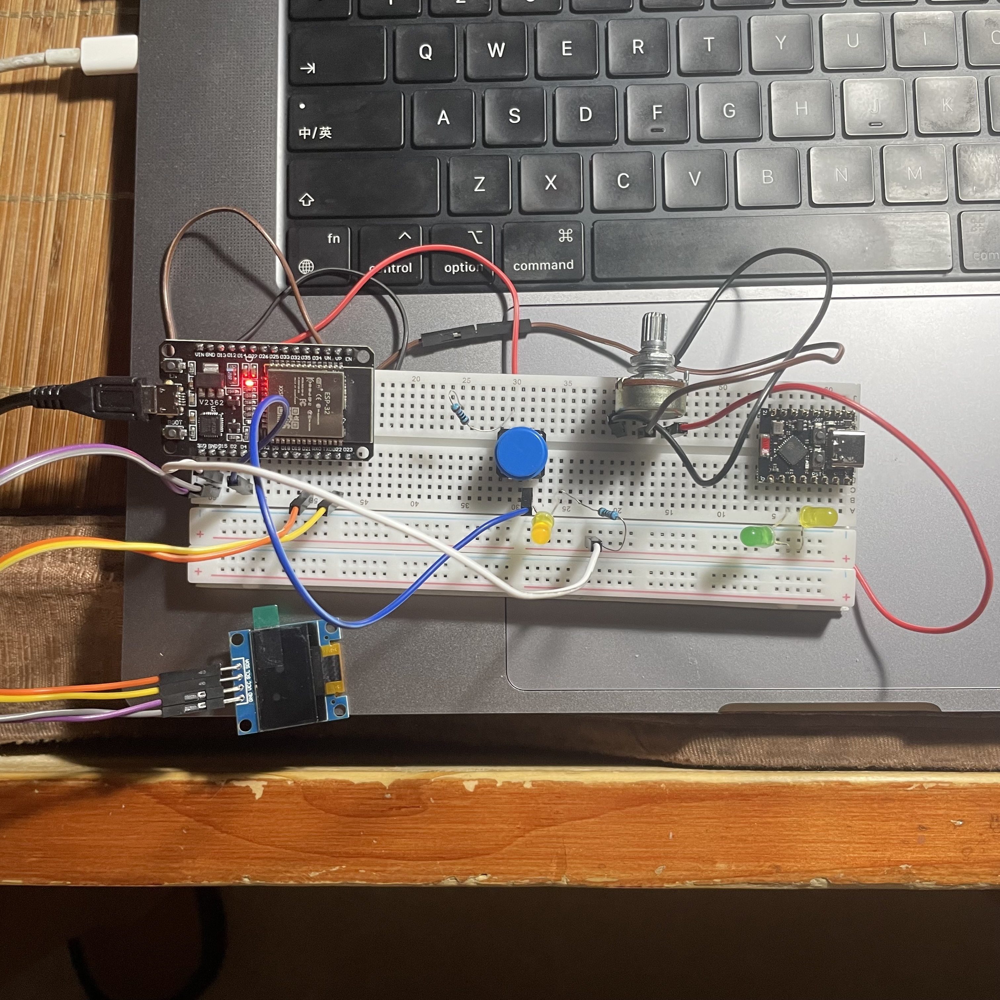

# espanalog
ESP32 可变电阻控制 led 亮度,   freeRtOS 的 task / queue 实现

可变电阻两边引脚一边接 5v 电源, 另一边接地, 中间接引脚34
led 接 d4 引脚, 串一电阻后, 接地

配置如下

```aiignore
[env:esp32dev]
platform = espressif32@6.9.0
board = esp32dev
framework = espidf
monitor_speed = 115200
# 添加以下配置，编译时禁用调试日志
build_flags =
    -D CONFIG_BOOTLOADER_LOG_LEVEL_NONE
    -D CONFIG_LOG_DEFAULT_LEVEL_NONE
```

注意以下代码
```aiignore
void app_main() {
    // 关键修复：加入延时以等待系统完全稳定，抑制上电乱码
    vTaskDelay(pdMS_TO_TICKS(500));
    ...
    }
```


esp32 dev module 上写一个 34引脚模拟读取可变电阻并打印模拟值到串口, 要求使用 platformio + esp-idf ,

1.  用 freertos 的 task 来读取 34引脚, 对获取的数据映射为 0 到 15之间的输出,  当输出数据( 0 到 15之间) 有变化时, 写入队列
2.  用另一个 task 来接收队列中的数据, 打印到串口 , 同时, 以 0到 15 的数据变化, 改变 ESP32 的 d4 引脚, 让接在 d4 上的 LED 亮度随数据改变


电路板如下图


